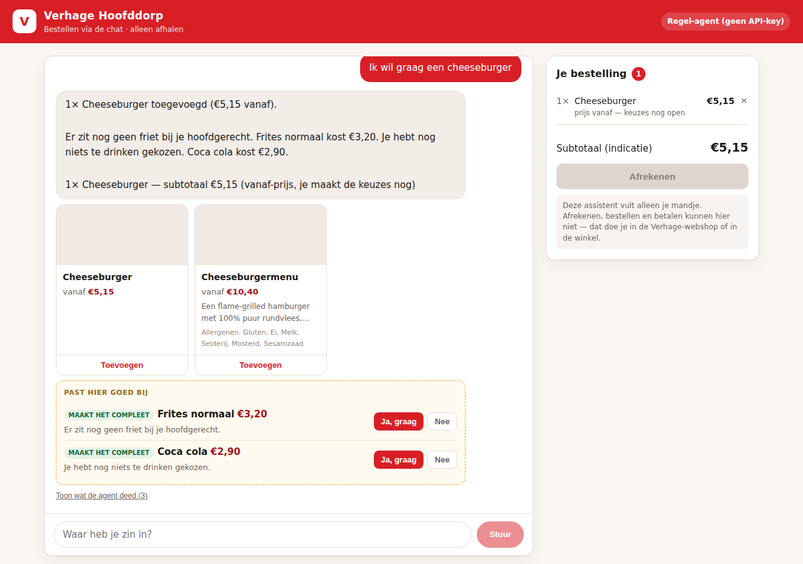

# Verhage AI — bestellen via de chat

An agentic ordering interface for the [Verhage Hoofddorp](https://verhage.nl/assortiment/verhage-hoofddorp/1)
webshop. A guest composes their order by chatting; the agent searches the real
assortment, fills the cart, and suggests things that go with what they picked.

**It cannot check out.** Not by instruction — by construction. No tool, endpoint
or UI control exists that places an order or takes a payment.



## What it does

- **Order through chat.** "Ik wil een cheeseburger", "2 frites met mayo",
  "iets vegetarisch", "haal de cola eruit" — all handled in conversation.
- **Cross-sells with a reason.** After each change the agent looks for what is
  missing from the meal (fries, a drink, a sauce, a dessert) or a better-value
  menu version of a burger, and offers at most two, each with the reason shown.
  Saying "nee" retires that suggestion for the rest of the session.
- **Fills the cart, and only the cart.** Every cart change goes through the
  agent — even the buttons in the UI send a chat message rather than mutating
  state directly, so the conversation stays the single source of truth.
- **Renders what models actually emit.** Replies come back with markdown bold
  and lists whatever the prompt says, so the chat bubble parses the common
  subset into elements (never raw HTML).
- **Runs on Anthropic, OpenRouter, or no key at all.** Same tools, same
  guarantees — see [The agent](#the-agent).
- **Never checks out, orders or pays.** See [Guardrails](#guardrails).

## Quick start

```bash
npm install
npm run dev          # http://localhost:5173
```

No API key required — see [The agent](#the-agent) for running it on Claude or
on any OpenRouter model instead.

```bash
npm test             # 110 tests
npm run build        # production bundle
npm start            # serves the built app on :3001
npm run catalog      # re-scrape the live assortment
```

## The agent

The agent runs a standard tool-use loop over these eight tools:

| Tool | Purpose |
| --- | --- |
| `search_products` | Search by text, category, tag, price, allergens |
| `get_product` | Full detail for one product |
| `add_to_cart` | Add a product (with quantity and an optional note) |
| `update_cart_item` | Change a quantity |
| `remove_from_cart` | Remove a line |
| `clear_cart` | Empty the cart |
| `view_cart` | Read the current order |
| `suggest_cross_sell` | Ranked, explained cross-sell candidates |

**Three interchangeable providers drive that same tool set:**

| Provider | Selected by | Default model |
| --- | --- | --- |
| **Anthropic** | `ANTHROPIC_API_KEY` | `claude-opus-5`, low effort — taking an order is simple and latency-sensitive |
| **OpenRouter** | `OPENROUTER_API_KEY` | `deepseek/deepseek-v4-flash-0731` — or any of ~400 tool-calling models |
| **Rule-based** | nothing configured | — parses intent, quantities, dietary wishes and yes/no answers with rules instead of a model |

Whichever is active, the tools are identical, so cart behaviour, cross-selling
and the no-checkout guarantee do not change with the model behind it. The
rule-based agent is what makes the app runnable and fully testable with no
credentials. The header badge shows the live provider and model.

```bash
# Anthropic
ANTHROPIC_API_KEY=sk-ant-... npm run dev

# OpenRouter, on the default model
OPENROUTER_API_KEY=sk-or-... npm run dev

# ...or any other tool-calling model
OPENROUTER_API_KEY=sk-or-... OPENROUTER_MODEL=openai/gpt-5.2 npm run dev
```

#### Model notes

A turn makes two to four sequential calls (search → add → cross-sell), so
latency is roughly the model's output throughput times the tokens it generates
— reasoning tokens included. Measured on the flows above:

| Model | Per reply | Notes |
| --- | --- | --- |
| `deepseek/deepseek-v4-flash-0731` (default) | ~8–27s | Handles ambiguity well ("alleen een cheeseburger of een menu?"); cheap, not free |
| `nvidia/nemotron-3.5-lightning:free` | ~30–150s | Free and correct, but a reasoning model at ~14 tok/s makes for a slow chat |

Both order correctly, cross-sell, and refuse to check out.
`OPENROUTER_REASONING_EFFORT` (`minimal`…`max`) sets reasoning depth on models
that expose it; unset leaves the model's own default, and `off` omits the
parameter for models that reject it. Reasoning *output* is always excluded —
otherwise a reply truncated mid-thought arrives with the raw chain of thought
in it.

#### Configuring it with `.env`

Copy `.env.example` to `.env` in the **project root** and fill in a key:

```bash
cp .env.example .env
# then edit .env:
#   OPENROUTER_API_KEY=sk-or-...
#   AGENT_PROVIDER=openrouter
npm run dev
```

The server loads `.env` itself on startup, so no export is needed. Real
environment variables take precedence over the file, which is how
`AGENT_PROVIDER=fallback npm test` and container-injected config override a
local `.env`.

Whether it worked is printed on startup and shown in the header badge:

```
Verhage AI running on http://localhost:3001
  env:      .env geladen
  agent:    OpenRouter (deepseek/deepseek-v4-flash-0731)
```

If it says `Regel-agent (rule-based)`, the next line says why — the usual cause
is a `.env` in the wrong directory, or a key name that does not match. Without
`AGENT_PROVIDER`, the first configured provider wins (Anthropic before
OpenRouter). Naming a provider whose key is missing is a startup error and a
`503` on `/api/chat`, rather than a silent downgrade to a different agent than
you asked for.

### Adding another provider

`server/agent/providers/` holds one module per provider, each exporting
`isConfigured()`, `model()` and `run()`. Tool definitions live once in
`server/agent/tools.js` and are translated per wire format — Anthropic's
`input_schema` shape and OpenAI's `function.parameters` shape come from the
same source, so a provider cannot end up with a different set of capabilities.

## Guardrails

The constraint is enforced in four independent places, so no single mistake —
including a model that decides to be helpful — can produce an order.

1. **No capability exists.** The tool surface has no order, checkout, pickup-time
   or payment tool, on any provider. An invented tool call (`place_order`)
   returns an error explaining the assistant can only compose a basket.
2. **No endpoint exists.** `/api/checkout`, `/api/order`, `/api/pay` and friends
   answer `501 not_implemented` rather than 404, so the boundary is deliberate
   and visible.
3. **The prompt says so**, and forbids inventing an order number, payment link
   or confirmation.
4. **The UI says so.** The checkout button is permanently disabled and explains
   why; every cart response carries `checkoutAvailable: false`.

`tests/guardrails.test.js` asserts all of it, including that the agent declines
five different ways of asking to pay while leaving the cart untouched.
`tests/openrouter.test.js` re-checks the tool surface and the refusal of an
invented `place_order` call on the OpenRouter path specifically.

## The catalog

`data/catalog.json` holds 200 products across 17 categories, normalised from the
live storefront by `scripts/build-catalog.mjs`. The site is an Angular app that
inlines its resolved state in a `<script id="ng-state">` tag, which is where the
assortment comes from. Three things the raw feed does that the script handles:

- **Configurable products are placeholders.** Burgers and menus ship as a
  `DUMMY` product whose real name, description, image and *from* price live on
  the position, with variants behind a lazily-loaded option set. Dropping them
  would delete the entire Burgers category; they are kept and flagged
  `priceFrom: true`.
- **Product ids are reused.** A dozen unrelated sauces share one placeholder id,
  so a slug (`frites-normaal`) is the stable key and the numeric id is kept only
  as `sourceId`.
- **Items are listed more than once.** Bestsellers mirrors other categories, and
  the Halal category repeats names of regular items — those get a `(halal)`
  suffix so a genuine variant is not collapsed into the original.

Product options (the drink or sauce choice inside a menu) are fetched per
product by the real storefront and are not in the payload, so a configurable
item shows a *vanaf* price and the cart marks the total as an estimate.

Re-run `npm run catalog` to refresh; the shape is asserted by
`tests/catalog.test.js`.

## Layout

```
data/catalog.json          normalised assortment (generated)
scripts/build-catalog.mjs  scraper + normaliser
server/
  env.js                   loads .env before anything reads it
  catalog.js               search and ranking
  cart.js                  cart state — the only mutable state
  crosssell.js             cross-sell rules
  agent/
    tools.js               the agent's entire capability surface, both formats
    prompt.js              system prompt
    index.js               provider selection
    fallback.js            rule-based agent (no API key needed)
    providers/
      anthropic.js         Anthropic Messages API loop
      openrouter.js        OpenAI-compatible loop for OpenRouter
  index.js                 HTTP API
src/                       React chat + cart UI
  lib/richtext.js          parses the markdown models emit
tests/                     110 tests
```

## Notes

This is a demonstration built against a public menu; it is not affiliated with
Verhage. Prices and assortment are a snapshot of the live site and a *vanaf*
price is a starting price, not a final one.
